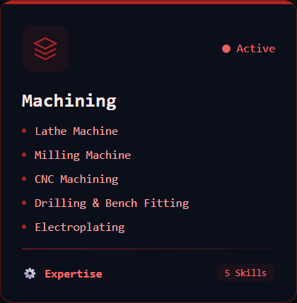
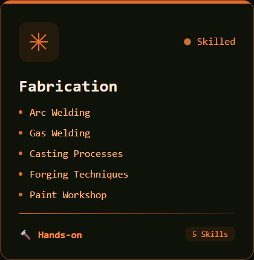
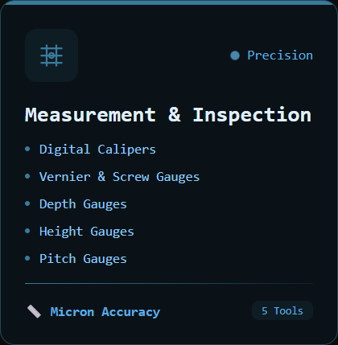
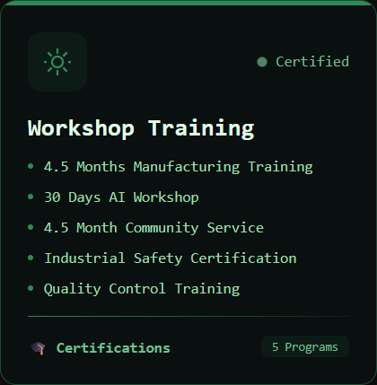

<!-- Main Banner  -->

  <h2 style="margin-top:-10px; font-weight:600;">
    Hi there, welcome to my GitHub profile!
  </h2>

  

  

<!-- Tech Stack -->
### **Tools & Languages:**

  
  
  
  
  
  
  
  
  
  
  
  
  
  
  
  
  
  

 

<!-- Profile Summary -->

  

<!-- Divider -->

<!-- Gradient Line -->

  

<!-- Technical Stack -->

  <h2 align="center">
    ✦
    
    ✦
  </h2>

### CAD & Simulation Software:

  <table>
    <tr>
      <td align="center"> <b>SolidWorks</b></td>
      <td align="center"> <b>AutoCAD</b></td>
      <td align="center"> <b>ANSYS</b></td>
      <td align="center"> <b>Autodesk CFD</b></td>
      <td align="center"> <b>Proteus 9</b></td>
      <td align="center"> <b>EES</b></td>
    </tr>
  </table>

### Programming & Development:

  <table>
    <tr>
      <td align="center"> <b>Python</b></td>
      <td align="center"> <b>C++</b></td>
      <td align="center"> <b>MapleSoft</b></td>
      <td align="center"> <b>Matlab</b></td>
      <td align="center"> <b>Git</b></td>
      <td align="center"> <b>GitHub</b></td>
      <td align="center"> <b>VS Code</b></td>
    </tr>
  </table>

### Project Management & AI:

  <table>
    <tr>
      <td align="center"> <b>Primavera P6</b></td>
      <td align="center"> <b>OpenBom</b></td>
      <td align="center"> <b>Excel Expert</b></td>
      <td align="center"> <b>Machine Learning</b></td>
      <td align="center"> <b>Deep Learning</b></td>
      <td align="center"> <b>Data Analysis</b></td>
    </tr>
  </table>

---

## Manufacturing & Engineering Expertise

  

    
    
    
    
  

## Professional Highlights

  

    
    
    
  

---

<!-- ═══════════════════════════════════════════════════════════════ -->
<!--                     Github Analytics                          -->
<!-- ═══════════════════════════════════════════════════════════════ -->

  <h2 align="center">
    ✦
    
    ✦
  </h2>

<!--Table -->
<table width="100%" cellpadding="0" cellspacing="0" border="0" style="border-collapse: collapse; margin-left: -8px; margin-right: -8px; width: calc(100% + 16px);">
  <tr>
    <td style="padding: 0; margin: 0; width: 50%;">
      
    </td>
    <td style="padding: 0; margin: 0; width: 50%;">
      
    </td>
  </tr>
</table>

<!--Animated of Winner Trophies -->

<!--Trophies -->

  

    
  

<!-- 3D Animated Bigger Graph -->

---

<!-- ═══════════════════════════════════════════════════════════════ -->
<!--                      CONNECT WITH ME                          -->
<!-- ═══════════════════════════════════════════════════════════════ -->

  

  

  

    
    
    
    
    
    
  

 
 

  &nbsp;&nbsp;
  &nbsp;&nbsp;
  &nbsp;&nbsp;
  &nbsp;&nbsp;
  &nbsp;&nbsp;
  

<!-- Final Call to Action – Killer Button -->

<!-- Text -->

  <strong>Research • Technical Roles • AI + Engineering Projects</strong>

  <em>Last Updated: May 2026 • Built with precision for engineering excellence</em>

  

<!-- 3D Activity City -->

  

<!-- Animated Real Snake Graph Style -->

